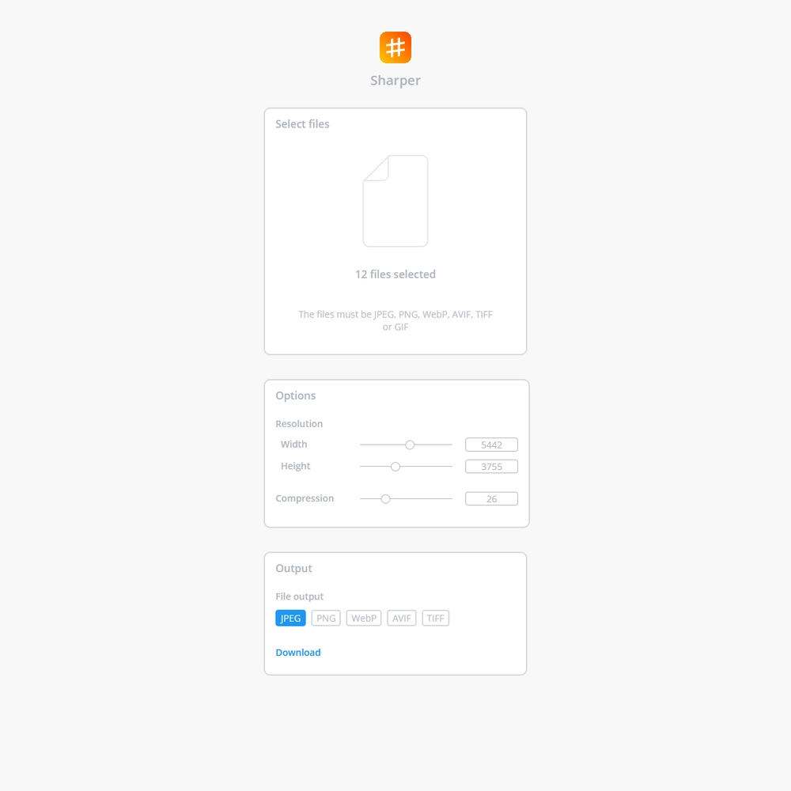

<p align="center">
  
</p>

# sharper
Sharper is an image converter based on the sharp image processor (https://github.com/lovell/sharp). It allows the conversion of JPEG, PNG, WebP, AVIF, TIFF and GIF, into JPEG, PNG, WebP, AVIF and TIFF. It also gives you the option of changing the compression and resolution of the images.

## Install packages
```
npm install
```

## Build project
```
gulp
```

## Run server
```
nodemon build/app.js
```

## BE AWARE
This web app doesn't do validation, if you want to make a website with it you will have to implement it yourself. You can also allow users to upload SVG files but users can inject javascript code in SVG so it's dangerous.

## Example image of the App
